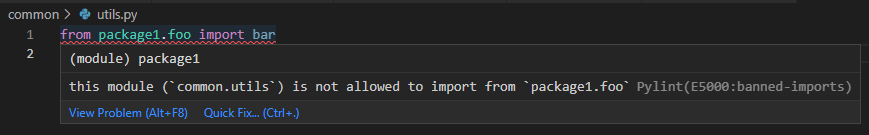

# pylint module boundaries

a pylint plugin to enforce boundaries between modules in your project. similar to nx's
[enforce-module-boundaries](https://nx.dev/core-features/enforce-project-boundaries) eslint plugin

## example

say you have three packages in your project - `common`, `package1`, and `package2` - you can use the `banned-imports` rule to prevent `common` from importing anything from `package1` or `package2`, thus avoiding issues such as circular dependencies.

Pylint can then be used to detect any violations of this rule:



see [usage](/#usage) below for a config example

## installing

```
poetry install pylint-module-boundaries
```

## usage

```toml
# pyproject.toml
[tool.pylint.MASTER]
load-plugins = "pylint_module_boundaries"
# (currently uses regex but i want to replace it with something better in the future)
banned-imports = '''
{
    "common(\\..*)?": ["package1(\\..*)?", "package2(\\..*)?"],
    "scripts(\\..*)?": ["package1(\\..*)?", "package2(\\..*)?"]
}
'''
```
